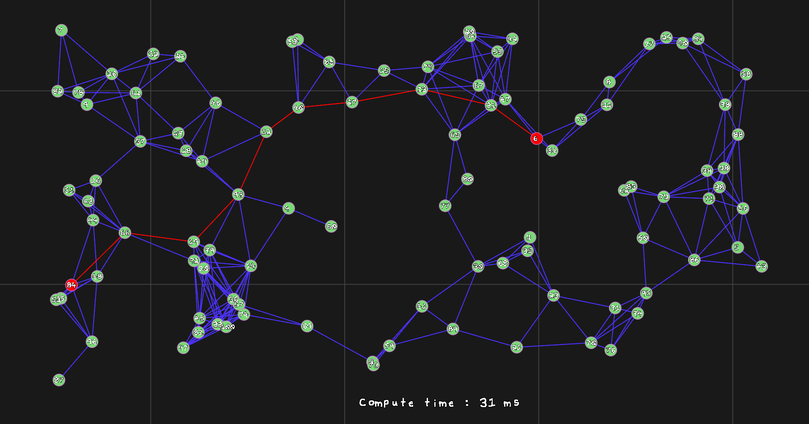
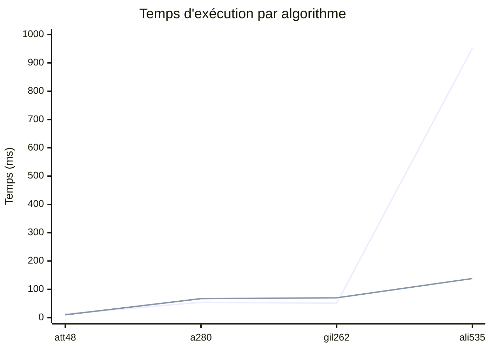
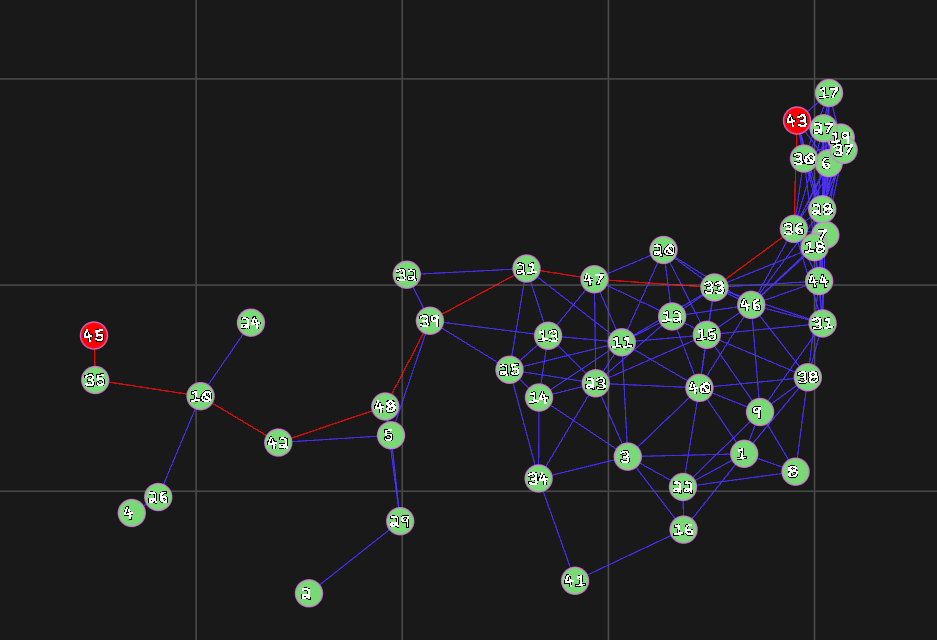
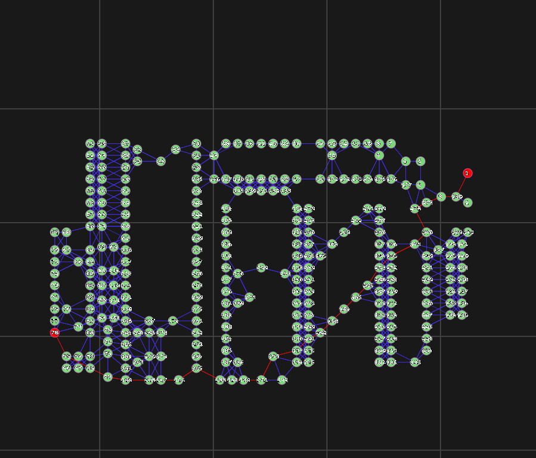
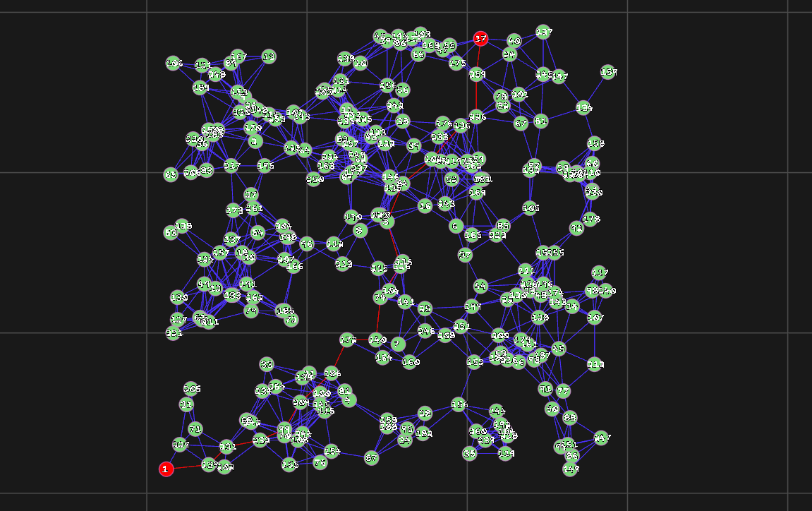
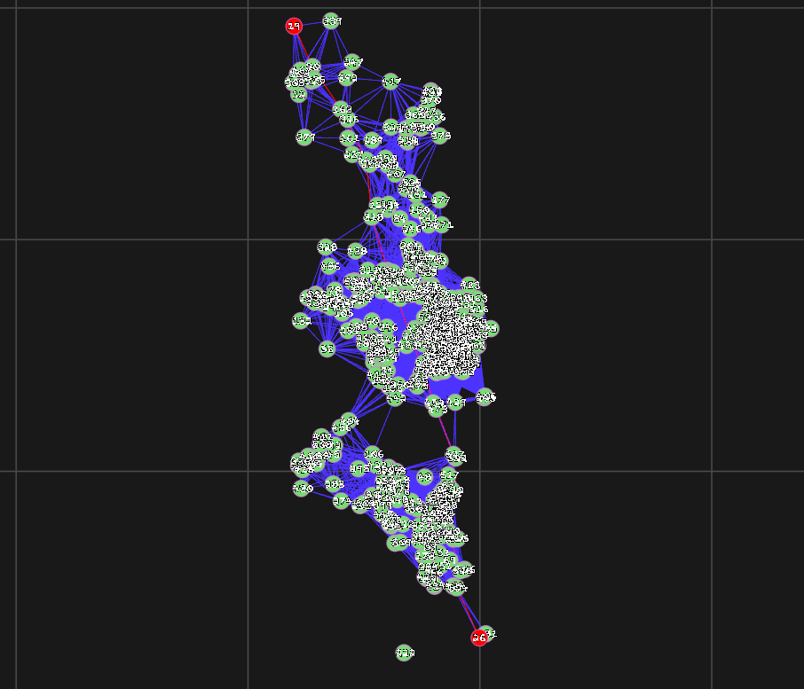
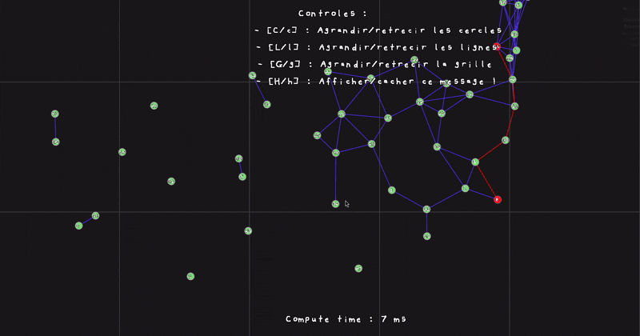
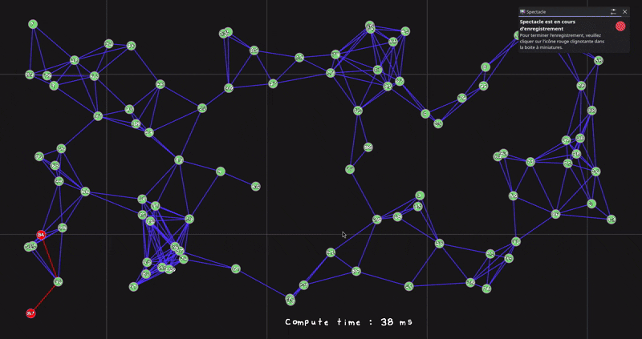

# Cheminement optimal dans les graphes

**Projet STDO - ENSIIE FISA 1A**



Eva GENTILHOMME, Arthur PINEL

## 1. Introduction

Ce projet implémente l'algorithme de Dijkstra et deux variantes A* et la recherche bidirectionnelle pour calculer la plus courte chaîne entre deux sommets dans un graphe euclidien non orienté. L'objectif est double : produire des implémentations efficaces et comparer expérimentalement les trois algorithmes sur des instances réelles issues de la TSPLIB (att48, a280).

En complément, un outil de visualisation interactif a été développé pour explorer les instances et observer les chemins calculés en temps réel.


## 2. Choix techniques

### 2.1 Langage : C plutôt que Java

Le sujet préconise Java pour l'implémentation des algorithmes. Nous avons fait le choix du C pour l'ensemble du projet (algorithmes et moteur de rendu), pour les raisons suivantes :

- **Contrôle mémoire explicite** : la gestion manuelle des allocations (graphe, tas, structures de chemin) permet d'éviter les coûts cachés du garbage collector lors des comparaisons de performance, et de mesurer un coût mémoire réel et déterministe.
- **Performance brute** : sur des graphes de grande taille (TSPLIB), l'absence de JIT warm-up et l'accès direct à la mémoire (pas de boxing d'objets) donnent des mesures de temps plus stables et représentatives du coût algorithmique pur, plutôt que des effets de la JVM.
- **Intégration avec le moteur de rendu** : le bonus visualisation utilise OpenGL/GLFW, dont les bindings natifs sont plus directs en C qu'en Java (pas de couche JNI), ce qui simplifie l'architecture globale et réduit les dépendances.


### 2.2 Structures utilisées

#### 2.2.1 Table de hachage

Nous avons implémenté une table de hachage simple en C, avec chaînage quand collision il y a. Le choix a été fait de rendre cette structure "générique", c'est à dire qu'elle demande un pointeur vers void en tant que valeur, et à l'initialisation elle demande la fonction permettant de libérer la mémoire des valeurs (pour quand un objet est retiré de la hashmap, ou quand la hashmap est libérée).
De cette façon, nous pouvons l'utiliser autant pour stocker des chemins dans le graphe, que pour stocker les noeuds marqués dans les divers algorithmes implémentés.

#### 2.2.2 Tas

Un tas, cette fois spécialisé pour stocker des sommets, a aussi été implémenté. 
Nous avons implémenté un tas binaire priorisé minimum, et nous pouvons donc changer la priorisation d'un chemin à partir du noeud associé avec, que ce soit en augmentant la priorité (il sera moins important) ou en la réduisant.
En mémoire, il est représenté par une array contigue qui est réallouée au besoin.

Nous utilisons le tas dans chaque algorithme pour stocker les noeuds non-visités, ainsi que les prioriser selon leur distance par rapport à la racine. La structure garantissant que chaque parent a une distance inférieure à ses enfants, quand nous utilisons `edge *heap_pop(heap *h)`, nous avons la garantie d'avoir le meilleur noeud à utiliser.

#### 2.2.3 Graphe

Le graphe est représenté par une table de hachage associant à chaque sommet la liste de ses voisins et des coûts d'arête associés, conformément à la section 3.1 du sujet. 
Le nom des sommets est aussi stocké, et l'ajout d'un sommet dans un sens l'ajoute aussi dans l'autre dans la table de hachage interne, pour que le graphe reste non-orienté.

### 2.3 Construction des instances

Les graphes sont construits à partir des fichiers TSPLIB selon la règle du sujet : une arête `{i, j}` existe si la distance euclidienne entre les points `i` et `j` est inférieure à `p%` de la plus grande distance observée dans l'instance. Le seuil `p` est fixé statiquement par instance (pas de variation dynamique du seuil pendant l'exécution).

```
threshold = p * max_dist
arête(i, j) existe ⟺ dist(i, j) ≤ threshold
```

## 3. Algorithmes implémentés

### 3.1 Dijkstra

Implémentation standard de l'algorithme décrit en section 2.1 du sujet : exploration par ordre croissant de distance depuis la racine, jusqu'à épuisement de la frontière ou (selon la variante d'arrêt utilisée) jusqu'à extraction du sommet cible.
Une hashmap est utilisée pour stocker les résultats (le noeud visité, ainsi que la distance totale pour y arriver depuis le noeud source), et un pointeur vers int est utilisé pour mettre à jour le nombre de sommets visités. 
En interne de l'algorithme, une table de hachage est aussi utilisée pour marquer les points. Elle est utilisée pour simuler un Set, c'est à dire une structure de données non-ordonnée et sans répétitions, donc nous initialisons chaque valeur avec juste un octet alloué, qui est libéré à la libération de la hashmap.

### 3.2 A*

Le sujet propose la distance euclidienne au sommet destination comme heuristique par défaut :

```
h(x) = √((x_p − x_x)² + (y_p − y_x)²)
```

Cette heuristique est admissible (elle ne surestime jamais le coût réel restant, car les coûts d'arête du graphe sont eux-mêmes des distances euclidiennes), ce qui garantit l'optimalité de A* sur ces instances.
Le seul problème c'est que ça demande de pré-compiler une table pour cette heuristique: si nous savons à l'avance quel chemin nous voulons faire il n'y a pas de problème (on a besoin que de compiler depuis un noeud), mais si ne le connait pas on doit compiler pour chaque noeud vers chaque noeud.

D'un point de vue technique, nous stockons cette heuristique dans un graphe donné en argument en plus du graphe initial.

### 3.3 Recherche bidirectionnelle

Implémentation de la variante décrite en section 2.2 du sujet : exploration alternée depuis la source et depuis la destination, avec arrêt dès qu'un sommet est examiné dans les deux directions, et mise à jour de la meilleure chaîne trouvée via la condition :

```
π_av(p) > π_av(u) + c_uv + π_ar(v)  ⟹  mise à jour
```

Pour notre algorithme, nous alternons strictement entre avant/arrière jusqu'à qu'une itération tombe sur un noeud déjà visité par le passage opposé.

## 4. Moteur de rendu (Bonus visualisation)

### 4.1 Architecture générale

Le moteur de rendu est un renderer 2D OpenGL dédié, écrit en C avec un minimum de dépendances externes : uniquement OpenGL et GLFW (gestion de fenêtre et d'entrées). Ce choix limite la surface de dépendance et permet une optimisation fine du pipeline de rendu, en évitant la surcharge d'un moteur 2D généraliste non adapté au cas d'usage (rendu de graphes : cercles + segments en grand nombre).

Le rendu repose sur de l'**instancing** : les sommets (cercles) et les arêtes (lignes) sont chacun dessinés en un seul draw call par lot, via des buffers d'instances dédiés (`circle_renderer`, `line_renderer`), plutôt qu'un draw call par primitive. Cette approche réduit drastiquement l'overhead CPU↔GPU sur les instances de grande taille (plusieurs centaines à milliers de sommets/arêtes).

### 4.2 Fonctionnalités interactives

L'outil permet :

- **Navigation** : déplacement de la caméra par drag de la souris (clic gauche maintenu), zoom via la molette.
- **Sélection interactive des sommets origine/destination** : clic gauche pour fixer le sommet de départ, clic droit pour fixer le sommet d'arrivée. Le plus court chemin est recalculé et affiché immédiatement après chaque changement, sans relancer l'application.
- **Contrôles d'affichage** au clavier :

| Touche           | Effet                                              |
|------------------|----------------------------------------------------|
| `C` / `Shift+C`  | Agrandir / réduire les cercles (sommets)           |
| `L` / `Shift+L`  | Agrandir / réduire l'épaisseur des lignes (arêtes) |
| `G` / `Shift+G`  | Agrandir / réduire la grille de fond               |
| `A`              | Changer d'algorithme                               |
| `H` / `Shift+H`  | Afficher / cacher le message d'aide                |
| `Clique gauche`  | Définir un nouveau noeud source                    |
| `Clique droit`   | Définir un nouveau noeud cible                     |
| `Molette Souris` | Zoomer / Dé-zoomer                                 |


## 5. Utilisation

### Cloner le projet

```bash
git clone https://github.com/LePeruvienn/projet-stdo
cd projet-stdo
```

### Compiler

Le projet utilise CMake comme système de build, avec un Makefile en wrapper pour simplifier les commandes courantes.

```bash
make
```

ou directement avec les commandes de CMake :

```bash
cmake -B build
cmake --build build
```

### 5.3 Lancer le programme

```
Usage : bin/projet_stdo <chemin_vers_fichier.tsp> <p>
```

- `<chemin_vers_fichier.tsp>` : chemin vers une instance TSPLIB (par exemple `TSPLIB/res/att48.tsp`)
- `<p>` : paramètre de densité du graphe, entre `0` et `1` (proportion de la distance maximale en deçà de laquelle une arête est créée entre deux sommets)

Exemple :

```bash
./bin/projet_stdo TSPLIB/res/att48.tsp 0.15
```

> **Important** : le programme doit impérativement être lancé depuis la **racine du projet**. Les assets (shaders, polices, etc.) sont chargés via des chemins relatifs (`asset/shader/...`) ; lancer l'exécutable depuis un autre répertoire de travail empêche leur chargement et fait échouer le démarrage du moteur de rendu.

### 5.4 Compatibilité des instances

Pour cloner le répo `TSPLIB` avec toutes les instances nécessaire au test du programme veuillez cloner le sous module avec la commande :

```
git submodule update --init --recursive
```

Le programme prend en charge la quasi-totalité des fichiers `.tsp` du dépôt [TSPLIB](https://github.com/shredderzwj/TSPLIB/tree/master/res), tant que le fichier expose une section `NODE_COORD_SECTION` exploitable par le parseur.


> **Important** : Si il ya d'autres sections que `NODE_COORD_SECTION`, le parser n'arrivera pas à lire le fichier ; certain problème ne sont pas exploitable alors avec le loigiciel.

## 6. Résultats expérimentaux

Cette section doit comparer, pour chaque algorithme (Dijkstra, A*, bidirectionnel), sur les instances suivantes :

- `att48.tsp` : 48 sommets.
- `a280.tsp` : 280 sommets.
- `gil262.tsp` : 262 sommets.
- `ali535.tsp` : 535 sommets.

Tous disponible dans le dossier `TSPLIB/res` du projet. Je vous invite à tester de vous même de votre coté.

Avec les métriques suivantes :

- **Nombre de sommets visités** (marqués) avant terminaison
- **Temps de calcul** (Tout les calculs nécessaire pour calculer le chemin le plus court)

### Contexte des résultats

Les temps présentés correspondent au temps total de notre implémentation.

Pour **Dijkstra**, l'algorithme ne s'arrête pas lorsqu'il atteint la destination. Il calcule les plus courts chemins vers tous les sommets du graphe avant d'extraire le chemin demandé. Le nombre de sommets visités est donc généralement égal au nombre total de sommets de l'instance.

Pour **A\***, le temps inclut également la **construction du graphe contenant les distances euclidiennes utilisées comme heuristique** (seulement ce qui viennt du noeud cible). Ce coût supplémentaire explique pourquoi A* n'est pas toujours plus rapide que Dijkstra, malgré un nombre de sommets explorés bien plus faible.

Enfin, notre implémentation de la recherche **bidirectionnelle** n'est pas encore totalement correcte. Les valeurs de sommets visités sont donc à prendre avec précaution et ne permettent pas de comparer correctement cet algorithme avec les deux autres.


| Instance | p   | Source → Cible | Algo           | Sommets visités | Temps (ms) |
|----------|-----|----------------|----------------|-----------------|------------|
| att48    | 15% | 43 → 45        | Dijkstra       | 48              | 13 ms      |
| att48    | 15% | 43 → 45        | A*             | 12              | 10 ms      |
| att48    | 15% | 43 → 45        | Bidirectionnel | 174             | 12 ms      |

| Instance | p   | Source → Cible | Algo           | Sommets visités | Temps (ms) |
|----------|-----|----------------|----------------|-----------------|------------|
| a280     | 6%  | 1 → 78         | Dijkstra       | 280             | 54 ms      |
| a280     | 6%  | 1 → 78         | A*             | 165             | 67 ms      |
| a280     | 6%  | 1 → 78         | Bidirectionnel | 970             | 56 ms      |


**Autres instances** :

| Instance | p   | Source → Cible | Algo           | Sommets visités | Temps (ms) |
|----------|-----|----------------|----------------|-----------------|------------|
| gil262   | 8%  | 1 → 17         | Dijkstra       | 262             | 51 ms      |
| gil262   | 8%  | 1 → 17         | A*             | 114             | 70 ms      |
| gil262   | 8%  | 1 → 17         | Bidirectionnel | 800             | 50 ms      |

| Instance | p   | Source → Cible | Algo           | Sommets visités | Temps (ms) |
|----------|-----|----------------|----------------|-----------------|------------|
| ali535   | 10% | 19 → 26        | Dijkstra       | 534             | 952 ms     |
| ali535   | 10% | 19 → 26        | A*             | 22              | 138 ms     |
| ali535   | 10% | 19 → 26        | Bidirectionnel | 52 603          | 956 ms     |

### Courbes Dijkstra vs A*

Légende :
🔵 Dijkstra 
🟢 A* 

1. Temps d'exécution comparé (en ms)



Dijkstra explose lorsque les possiblité deviennet trop grande.

### Analyse des résultats

Les résultats montrent que **A\*** explore beaucoup moins de sommets que **Dijkstra**. L'heuristique permet de guider la recherche vers la destination au lieu d'explorer le graphe presque entièrement. Sur les grandes instances, l'écart devient très important : par exemple sur ali535, **A\*** ne visite que 22 sommets contre 534 pour **Dijkstra**.

En revanche, cette réduction du nombre de sommets ne se traduit pas toujours par un meilleur temps d'exécution. Dans notre implémentation, le **calcul de l'heuristique est inclus dans le temps mesuré** (seulement ce du noeuds cible), ce qui ajoute un coût fixe avant même le début de la recherche. Sur les petites instances, ce coût peut être plus important que le temps économisé pendant l'exploration.

Concernant la recherche bidirectionnelle, nous n'avons pas obtenu les résultats attendus. Les valeurs de sommets visités sont largement supérieures à la taille des graphes, ce qui montre que notre implémentation comporte encore un problème. Nous avons tout de même choisi de présenter ces résultats afin de montrer l'état actuel du projet, mais ils ne permettent pas de tirer de conclusion sur les performances de cet algorithme.

### Caputures décrans des problèmes musurés

| att48.tsp                            |
|--------------------------------------|
|  |

| a280.tsp                             |
|--------------------------------------|
|    |

| gil262.tsp                             |
|----------------------------------------|
|  |

| ali535.tsp                             |
|----------------------------------------|
|  |


## 7. Capture vidéo




---

Merci d'avoir lu <3
