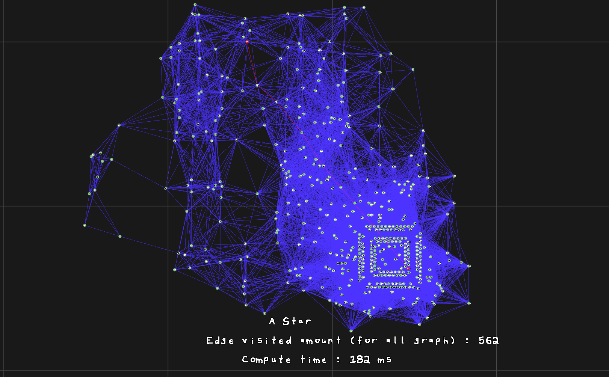

# Cheminement optimal dans les graphes

**Projet STDO - ENSIIE FISA 1A**


Eva GENTILHOMME, Arthur PINEL

## 1. Introduction

Ce projet implémente l'algorithme de Dijkstra et deux variantes A* et la recherche bidirectionnelle  pour calculer la plus courte chaîne entre deux sommets dans un graphe euclidien non orienté. L'objectif est double : produire des implémentations efficaces et comparer expérimentalement les trois algorithmes sur des instances réelles issues de la TSPLIB (att48, a280).

En complément, un outil de visualisation interactif a été développé pour explorer les instances et observer les chemins calculés en temps réel.


## 2. Choix techniques

### 2.1 Langage : C plutôt que Java

Le sujet préconise Java pour l'implémentation des algorithmes. Nous avons fait le choix du C pour l'ensemble du projet (algorithmes et moteur de rendu), pour les raisons suivantes :

- **Contrôle mémoire explicite** : la gestion manuelle des allocations (graphe, tas, structures de chemin) permet d'éviter les coûts cachés du garbage collector lors des comparaisons de performance, et de mesurer un coût mémoire réel et déterministe.
- **Performance brute** : sur des graphes de grande taille (TSPLIB), l'absence de JIT warm-up et l'accès direct à la mémoire (pas de boxing d'objets) donnent des mesures de temps plus stables et représentatives du coût algorithmique pur, plutôt que des effets de la JVM.
- **Intégration avec le moteur de rendu** : le bonus visualisation utilise OpenGL/GLFW, dont les bindings natifs sont plus directs en C qu'en Java (pas de couche JNI), ce qui simplifie l'architecture globale et réduit les dépendances.


### 2.2 Représentation du graphe

Le graphe est représenté par une table de hachage associant à chaque sommet la liste de ses voisins et des coûts d'arête associés, conformément à la section 3.1 du sujet. L'implémentation utilise un chaînage pour la gestion des collisions (cf. `core/hashmap.c`).

### 2.3 Construction des instances

Les graphes sont construits à partir des fichiers TSPLIB selon la règle du sujet : une arête `{i, j}` existe si la distance euclidienne entre les points `i` et `j` est inférieure à `p%` de la plus grande distance observée dans l'instance. Le seuil `p` est fixé statiquement par instance (pas de variation dynamique du seuil pendant l'exécution).

```
threshold = p * max_dist
arête(i, j) existe ⟺ dist(i, j) ≤ threshold
```

## 3. Algorithmes implémentés

### 3.1 Dijkstra

Implémentation standard de l'algorithme décrit en section 2.1 du sujet : exploration par ordre croissant de distance depuis la racine, jusqu'à épuisement de la frontière ou (selon la variante d'arrêt utilisée) jusqu'à extraction du sommet cible.

### 3.2 A*

> **[À compléter] — l'heuristique h(x) n'est pas encore fixée.**

Le sujet propose la distance euclidienne au sommet destination comme heuristique par défaut :

```
h(x) = √((x_p − x_x)² + (y_p − y_x)²)
```

Cette heuristique est admissible (elle ne surestime jamais le coût réel restant, car les coûts d'arête du graphe sont eux-mêmes des distances euclidiennes), ce qui garantit l'optimalité de A* sur ces instances. À confirmer/détailler une fois l'implémentation finalisée.

### 3.3 Recherche bidirectionnelle

Implémentation de la variante décrite en section 2.2 du sujet : exploration alternée depuis la source et depuis la destination, avec arrêt dès qu'un sommet est examiné dans les deux directions, et mise à jour de la meilleure chaîne trouvée via la condition :

```
π_av(p) > π_av(u) + c_uv + π_ar(v)  ⟹  mise à jour
```

> **[À compléter] — préciser la stratégie d'équilibrage avant/arrière effectivement utilisée (alternance stricte, ou basée sur la taille de la frontière, etc.)**

## 4. Structure de données : le Tas

> **[Section à compléter ultérieurement — Partie 1 du projet non réalisée à ce stade]**

Cette section doit décrire :
- la structure de tas retenue (binaire, indexé pour `decrease-key`, etc.)
- les primitives implémentées : extraction du minimum, modification de priorité, suppression, insertion
- la complexité de chaque opération
- son intégration dans Dijkstra/A*/bidirectionnel (gestion de la frontière de sommets ouverts)

## 5. Moteur de rendu (Bonus visualisation)

### 5.1 Architecture générale

Le moteur de rendu est un renderer 2D OpenGL dédié, écrit en C avec un minimum de dépendances externes : uniquement OpenGL et GLFW (gestion de fenêtre et d'entrées). Ce choix limite la surface de dépendance et permet une optimisation fine du pipeline de rendu, en évitant la surcharge d'un moteur 2D généraliste non adapté au cas d'usage (rendu de graphes : cercles + segments en grand nombre).

Le rendu repose sur de l'**instancing** : les sommets (cercles) et les arêtes (lignes) sont chacun dessinés en un seul draw call par lot, via des buffers d'instances dédiés (`circle_renderer`, `line_renderer`), plutôt qu'un draw call par primitive. Cette approche réduit drastiquement l'overhead CPU↔GPU sur les instances de grande taille (plusieurs centaines à milliers de sommets/arêtes).

### 5.2 Fonctionnalités interactives

L'outil permet :

- **Navigation** : déplacement de la caméra par drag de la souris (clic gauche maintenu), zoom via la molette.
- **Sélection interactive des sommets origine/destination** : clic gauche pour fixer le sommet de départ, clic droit pour fixer le sommet d'arrivée. Le plus court chemin est recalculé et affiché immédiatement après chaque changement, sans relancer l'application.
- **Contrôles d'affichage** au clavier :

| Touche           | Effet                                              |
|------------------|----------------------------------------------------|
| `C` / `Shift+C`  | Agrandir / réduire les cercles (sommets)           |
| `L` / `Shift+L`  | Agrandir / réduire l'épaisseur des lignes (arêtes) |
| `G` / `Shift+G`  | Agrandir / réduire la grille de fond               |
| `A`              | Changer d'algorithme                               |
| `H` / `Shift+H`  | Afficher / cacher le message d'aide                |
| `Clique gauche`  | Définir un nouveau noeud source                    |
| `Clique droit`   | Définir un nouveau noeud cible                     |
| `Molette Souris` | Zoomer / Dé-zoomer                                 |


## 6. Utilisation

### 6.1 Cloner le projet

```bash
git clone https://github.com/LePeruvienn/projet-stdo
cd projet-stdo
```

### 6.2 Compiler

Le projet utilise CMake comme système de build, avec un Makefile en wrapper pour simplifier les commandes courantes.

```bash
make
```

Cette commande configure et compile l'ensemble du projet (algorithmes, moteur de rendu, exécutable principal).

### 6.3 Lancer le programme

```
Usage : bin/projet_stdo <chemin_vers_fichier.tsp> <p>
```

- `<chemin_vers_fichier.tsp>` : chemin vers une instance TSPLIB (par exemple `TSPLIB/res/att48.tsp`)
- `<p>` : paramètre de densité du graphe, entre `0` et `1` (proportion de la distance maximale en deçà de laquelle une arête est créée entre deux sommets)

Exemple :

```bash
./bin/projet_stdo TSPLIB/res/att48.tsp 0.15
```

> **Important** : le programme doit impérativement être lancé depuis la **racine du projet**. Les assets (shaders, polices, etc.) sont chargés via des chemins relatifs (`asset/shader/...`) ; lancer l'exécutable depuis un autre répertoire de travail empêche leur chargement et fait échouer le démarrage du moteur de rendu.

### 6.4 Compatibilité des instances

Le programme prend en charge la quasi-totalité des fichiers `.tsp` du dépôt [TSPLIB](https://github.com/shredderzwj/TSPLIB/tree/master/res), tant que le fichier expose une section `NODE_COORD_SECTION` exploitable par le parseur.

> **Important** : Si il ya d'autres sections que `NODE_COORD_SECTION`, le parser n'arrivera pas à lire le fichier ; certain problème ne sont pas exploitable alors avec le loigiciel.

## 8. Résultats expérimentaux

> **[Section à compléter — chiffres pas encore en main]**

Cette section doit comparer, pour chaque algorithme (Dijkstra, A*, bidirectionnel), sur les instances suivantes :

- att48, p = 15%, sommets 43 → 45
- att48, p = 12%, sommets 43 → 45
- a280, p = 6%, sommets 8 → 92

les métriques suivantes :

- **Nombre de sommets visités** (marqués) avant terminaison
- **Temps de calcul** (déjà mesuré via `bench_now_ms()` dans `TSP_Instance_compute_shortest_path`)
- **Coût du chemin trouvé** (pour validation croisée : les trois algorithmes doivent converger vers le même coût optimal sur une même instance)


> **[À remplir avec les chiffres]**

| Instance | p | Source → Cible | Algo | Sommets visités | Temps (ms) | Coût du chemin |
|---|---|---|---|---|---|---|
| att48 | 15% | 43 → 45 | Dijkstra | | | |
| att48 | 15% | 43 → 45 | A* | | | |
| att48 | 15% | 43 → 45 | Bidirectionnel | | | |
| att48 | 12% | 43 → 45 | Dijkstra | | | |
| att48 | 12% | 43 → 45 | A* | | | |
| att48 | 12% | 43 → 45 | Bidirectionnel | | | |
| a280 | 6% | 8 → 92 | Dijkstra | | | |
| a280 | 6% | 8 → 92 | A* | | | |
| a280 | 6% | 8 → 92 | Bidirectionnel | | | |

## 9. Capture vidéo




---

Merci d'avoir lu <3
